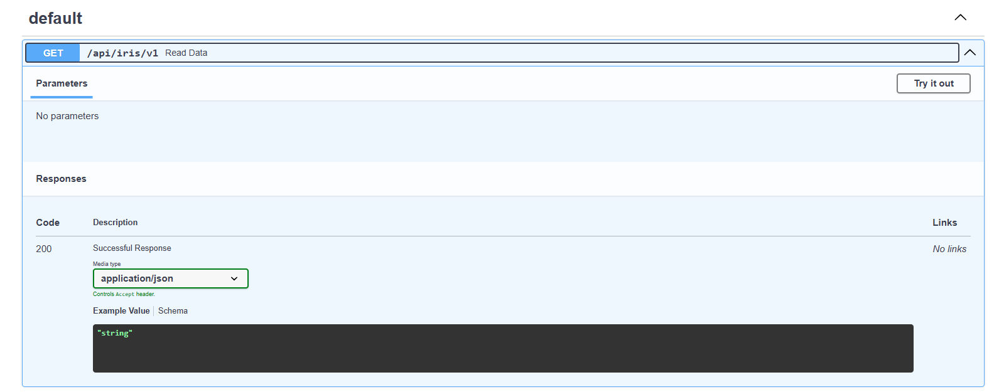
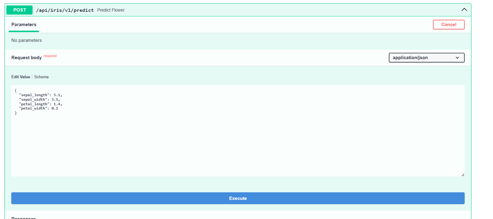
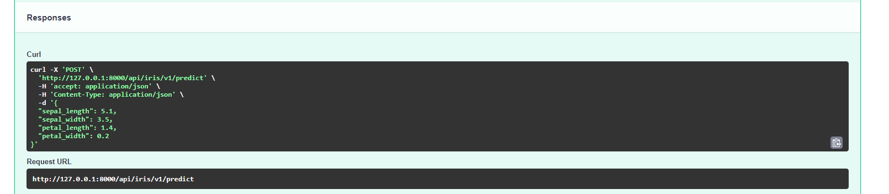
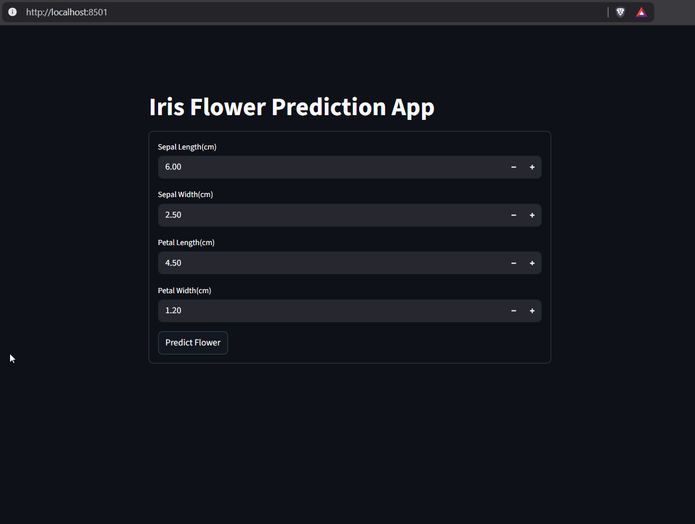
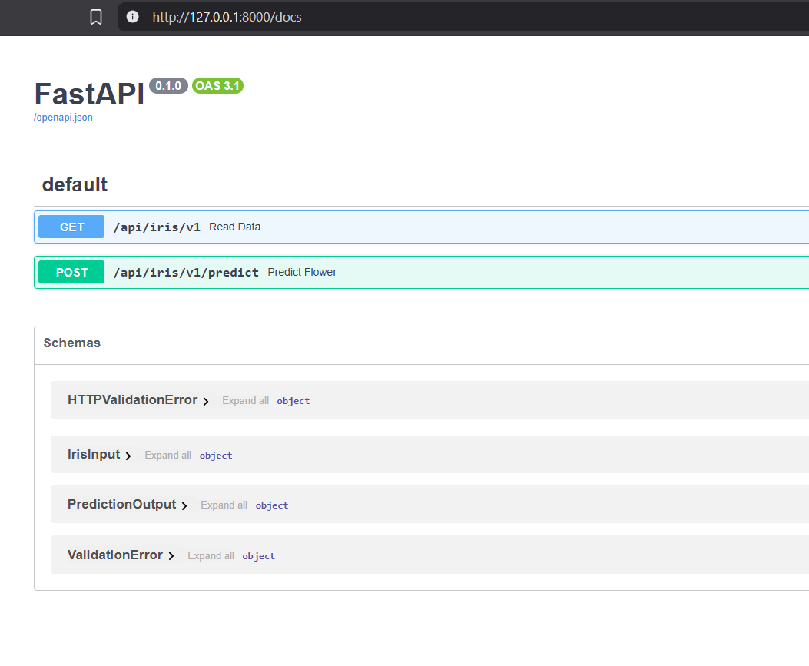
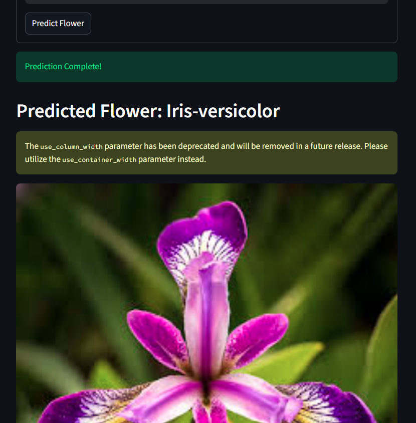

# Iris Flower Prediction Application

A full-stack machine learning application for predicting Iris flower species using FastAPI backend and Streamlit frontend. This project demonstrates end-to-end ML deployment with a user-friendly interface and RESTful API.

## Project Screenshots

### FastAPI- GET



### FastAPI- POST



### FastAPI- RESPONSE



### Streamlit Frontend Interface



### FastAPI Interactive Documentation



### Prediction Results



---

## Features

- **Interactive Web Interface**: User-friendly Streamlit dashboard for real-time predictions
- **RESTful API**: FastAPI backend with automatic OpenAPI documentation
- **Machine Learning Model**: Pre-trained classifier for Iris species prediction
- **Input Validation**: Pydantic models ensure data integrity and type safety
- **Visual Feedback**: Dynamic image display of predicted flower species
- **Real-time Predictions**: Instant classification results with loading indicators

## Architecture

```
├── api.py              # FastAPI backend with prediction endpoint
├── frontend.py         # Streamlit frontend interface
├── constants.py        # Path configurations
├── models/
│   └── iris_model.joblib    # Random-forest Classifier
├── data/
│   └── IRIS.csv             # Training dataset
└── assets/
    ├── Iris-setosa.jpg
    ├── Iris-versicolor.jpg
    └── Iris-virginica.jpg
```

## Getting Started

### Prerequisites

- Python 3.8 or higher
- pip package manager

### Installation

1. **Clone the repository**

   ```bash
   git clone <https://github.com/sameer-at-git/FastAPI-Implementation-with-Streamlit-on-IRIS-Dataset-to-Predict-Flower.git>
   cd iris-prediction-app
   ```
2. **Create a virtual environment** (recommended)

   ```bash
   python -m venv venv

   # On Windows
   venv\Scripts\activate

   # On macOS/Linux
   source venv/bin/activate
   ```
3. **Install dependencies**

   ```bash
   pip install fastapi uvicorn streamlit pandas joblib httpx pydantic
   ```
4. **Verify project structure**

   Ensure you have the following directories and files:

   - `models/iris_model.joblib` - Pre-trained model file
   - `data/IRIS.csv` - Dataset file
   - `assets/` - Folder containing flower images (Iris-setosa.jpg, Iris-versicolor.jpg, Iris-virginica.jpg)
   - `constants.py` - Configuration file with path definitions

### Running the Application

#### Step 1: Start the FastAPI Backend

Open a terminal and run:

```bash
uvicorn api:app --reload --host 127.0.0.1 --port 8000
```

The API will be available at `http://127.0.0.1:8000`

- **API Documentation**: http://127.0.0.1:8000/docs (Swagger UI)
- **Alternative Docs**: http://127.0.0.1:8000/redoc (ReDoc)

#### Step 2: Launch the Streamlit Frontend

Open a **new terminal** (keep the backend running) and execute:

```bash
streamlit run frontend.py
```

The application will open automatically in your browser at `http://localhost:8501`

---

## Usage

### Using the Streamlit Interface

1. Open the Streamlit app in your browser
2. Enter the following measurements:
   - **Sepal Length** (4.01 - 8.49 cm)
   - **Sepal Width** (1.81 - 4.99 cm)
   - **Petal Length** (0.81 - 7.49 cm)
   - **Petal Width** (0.01 - 2.99 cm)
3. Click the **"Predict Flower"** button
4. View the predicted species and corresponding flower image

### Using the API Directly

#### Get Dataset

```bash
curl -X GET "http://127.0.0.1:8000/api/iris/v1"
```

#### Make Prediction

```bash
curl -X POST "http://127.0.0.1:8000/api/iris/v1/predict" \
  -H "Content-Type: application/json" \
  -d '{
    "sepal_length": 5.1,
    "sepal_width": 3.5,
    "petal_length": 1.4,
    "petal_width": 0.2
  }'
```

**Response:**

```json
{
  "predicted_flower": "Iris-setosa"
}
```

---

## API Reference

### Endpoints

#### `GET /api/iris/v1`

Retrieve the complete Iris dataset.

**Response**: Array of iris flower records with measurements and species.

#### `POST /api/iris/v1/predict`

Predict the Iris species based on input measurements.

**Request Body:**

```json
{
  "sepal_length": 5.1,
  "sepal_width": 3.5,
  "petal_length": 1.4,
  "petal_width": 0.2
}
```

**Validation Rules:**

- `sepal_length`: 4.0 < value < 8.5
- `sepal_width`: 1.8 < value < 5.0
- `petal_length`: 0.8 < value < 7.5
- `petal_width`: 0.0 < value < 3.0

**Response:**

```json
{
  "predicted_flower": "Iris-setosa"
}
```

---

## Model Information

The application uses a pre-trained machine learning classifier(Random Forest) stored in `models/iris_model.joblib`. The model predicts one of three Iris species:

- **Iris-setosa**
- **Iris-versicolor**
- **Iris-virginica**

### Features Used for Prediction

- Sepal Length (cm)
- Sepal Width (cm)
- Petal Length (cm)
- Petal Width (cm)

---

## Technology Stack

| Component                    | Technology                |
| ---------------------------- | ------------------------- |
| **Backend Framework**  | FastAPI                   |
| **Frontend Framework** | Streamlit                 |
| **ML Library**         | scikit-learn (via joblib) |
| **Data Processing**    | Pandas                    |
| **HTTP Client**        | HTTPX                     |
| **Validation**         | Pydantic                  |
| **Server**             | Uvicorn                   |

---

## Project Structure Details

### `api.py`

FastAPI application that:

- Loads the pre-trained model
- Exposes REST endpoints for data retrieval and predictions
- Validates input using Pydantic models
- Returns predictions in JSON format

### `frontend.py`

Streamlit interface that:

- Provides an intuitive form for user input
- Communicates with the FastAPI backend
- Displays prediction results with visual feedback
- Shows corresponding flower images

### `constants.py`

Configuration file containing path definitions for:

- `DATA_PATH`: Location of dataset files
- `MODELS_PATH`: Location of trained models
- `ASSETS_PATH`: Location of flower images

---

## Contributing

Contributions are welcome! Please feel free to submit a Pull Request.

1. Fork the repository
2. Create your feature branch (`git checkout -b feature/AmazingFeature`)
3. Commit your changes (`git commit -m 'Add some AmazingFeature'`)
4. Push to the branch (`git push origin feature/AmazingFeature`)
5. Open a Pull Request

---

## License

This project is licensed under the MIT License - see the LICENSE file for details.

---

## Acknowledgments

- Iris dataset from the UCI Machine Learning Repository
- FastAPI for the excellent web framework
- Streamlit for the intuitive frontend framework

---

## Contact

For questions or feedback, please open an issue in the repository.

---

**Contact Me for Any Queries**
